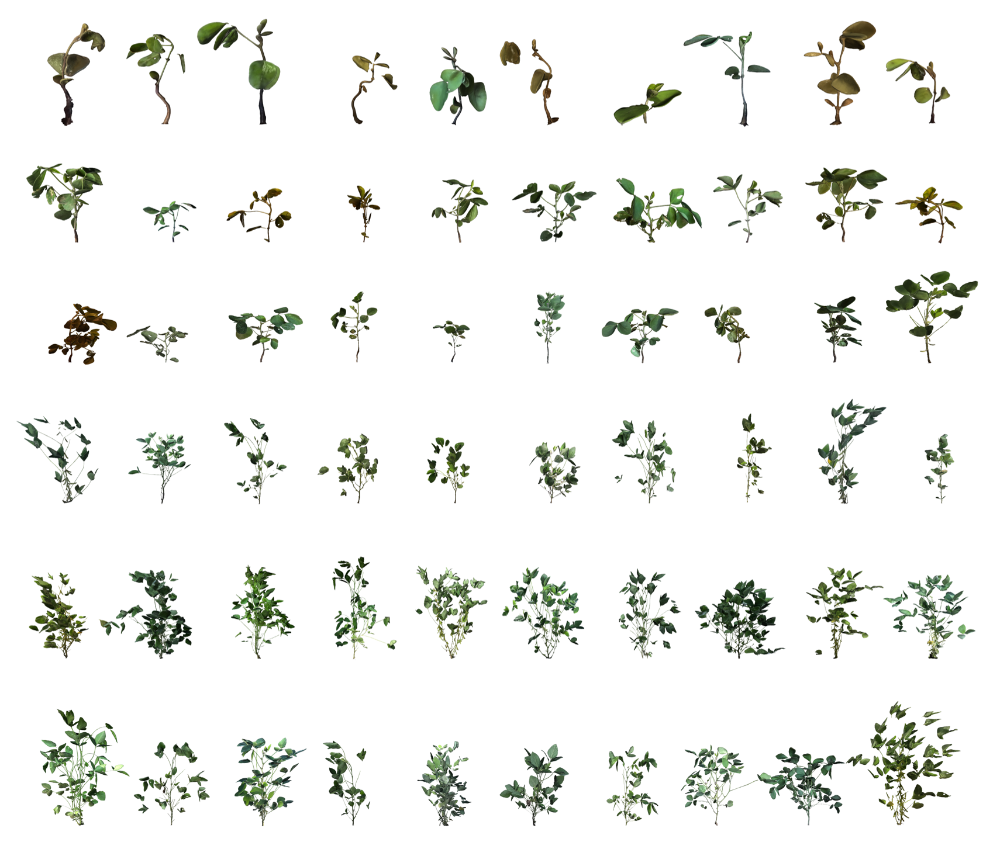

# Demeter: A Parametric Model of Crop Plant Morphology from the Real World (ICCV 2025)

[Project Page](https://tianhang-cheng.github.io/Demeter/) | [Mesh Dataset](https://drive.google.com/file/d/1OLa7JXfgj3QGRKKB0nxhRyndsH_peiaY/view?usp=sharing)


Demeter is a plant parametric models that is learned from 3D scans of real-world plants. It explicitly models the plant as a graph of stem and leaf.

## 1. Data

### Processed data

The processed 3d parametric plant samples are already included in the code.

### Raw data

The raw soybean mesh data can be found in this [google drive link](https://drive.google.com/file/d/1OLa7JXfgj3QGRKKB0nxhRyndsH_peiaY/view?usp=sharing). It contains 607 unprocessed meshes, which can be used for 3D generation/representation learning. The main stem are aligned to y-axis and the bottom tip lies in (0,0,0). We will release the correspondent 2D images soon.



## 2. Requirements

### Environment (Tested)

+ Linux
+ Python 3.11
+ CUDA 12.1
+ Pytorch 2.5.0

### Dependencies
Install PyTorch and other dependencies.
```bash
conda create -n demeter python=3.11 -y
conda activate demeter
pip install torch==2.5.0 torchvision==0.20.0 torchaudio==2.5.0 --index-url https://download.pytorch.org/whl/cu121

# basic dependencies for decoding
pip install -r requirements.txt
```

Install in editable mode

```
pip install -e .
```

for reconstruction from 3d point cloud, it is recommended to create a new envrionment following instruction in [Pointcept](https://github.com/Pointcept/Pointcept). But we recommend using manual annotation to create demeter parameters for now.

## 3. Usage

### a) Visualize parametric plant

decode demeter parameter to 3d mesh of soybean

```python
python decode.py --data_folder sample_params --sample_name 24_o --species soybean

python decode.py --data_folder sample_params --sample_name 08 --species ribes 

python decode.py --data_folder sample_params --sample_name 10008da --species maize

python decode.py --data_folder sample_params --sample_name 1 --species tobacco

python decode.py --data_folder sample_params --sample_name 02 --species rose
```

### b) Reconstruction parametric plant from point cloud

+ (Optional) Step 0: Fitting 2D leaf shape from images if you need other species
[script_process_leaf_contour/readme.md](script_process_leaf_contour/readme.md)

+ Step 1: Get point cloud
Monocular RGB video -> Raw 3D point clouds \
[third_party/2d-gaussian-splatting/readme.md](third_party/2d-gaussian-splatting/readme.md)

+ Step 2, Option A: manual annotate point clouds -> Demeter parameters \
[script_manual_annotation/readme.md](script_manual_annotation/readme.md)

+ Step 2, Option B: automatic multi-stage 3D point clouds -> Demeter parameters \
[script_auto_reconstruction/readme.md](script_auto_reconstruction/readme.md)
Note that this method is not accurate, so it's more recommanded to use manual segementation

+ Step 2, Option C: automatic feed-forward one-pass 3D point clouds -> Demeter parameters \
Working in progress.

+ Others: raw 3D point clouds -> baseline L-system parameteres \
[third_party/CropCraft/readme.md](third_party/CropCraft/readme.md)

### c) Simulation

Please refer to [Helios Tutorial](https://github.com/PlantSimulationLab/PyHelios/blob/master/docs/plugin_photosynthesis.md) for now.

## 4. Release Note

- [ ] editing tutorial (TBD)
- [ ] full soybean 2d image dataset (TBD)
- [x] learning leaf shape PCA from 2D leaf scanns (2026-5-26)
- [x] building demeter representation from your own annotated 3d point cloud (2026-4-24)
- [x] full soybean 3d dataset (2025-12-17)
- [x] sample data of other species (2025-11-1)
- [x] sample data of soybean (2025-10-7)
- [x] decoding (2025-10-7)
- [x] reconstruction from 3d point cloud (2025-10-8)
- [x] L-system baseline (2025-10-13)

## 5. Acknowledgement
This project is supported by NSF Awards #1847334 #2331878, #2340254, #2312102, #2414227, and #2404385. We greatly appreciate the NCSA for providing computing resources.

## 6. License
This code is released under the **Academic Research License (Non-Commercial)**.
For commercial inquiries, please contact [shenlong@illinois.edu](mailto:shenlong@illinois.edu). 
For code issue and academic collaboration, please contact [tcheng12@illinois.edu](mailto:tcheng12@illinois.edu).