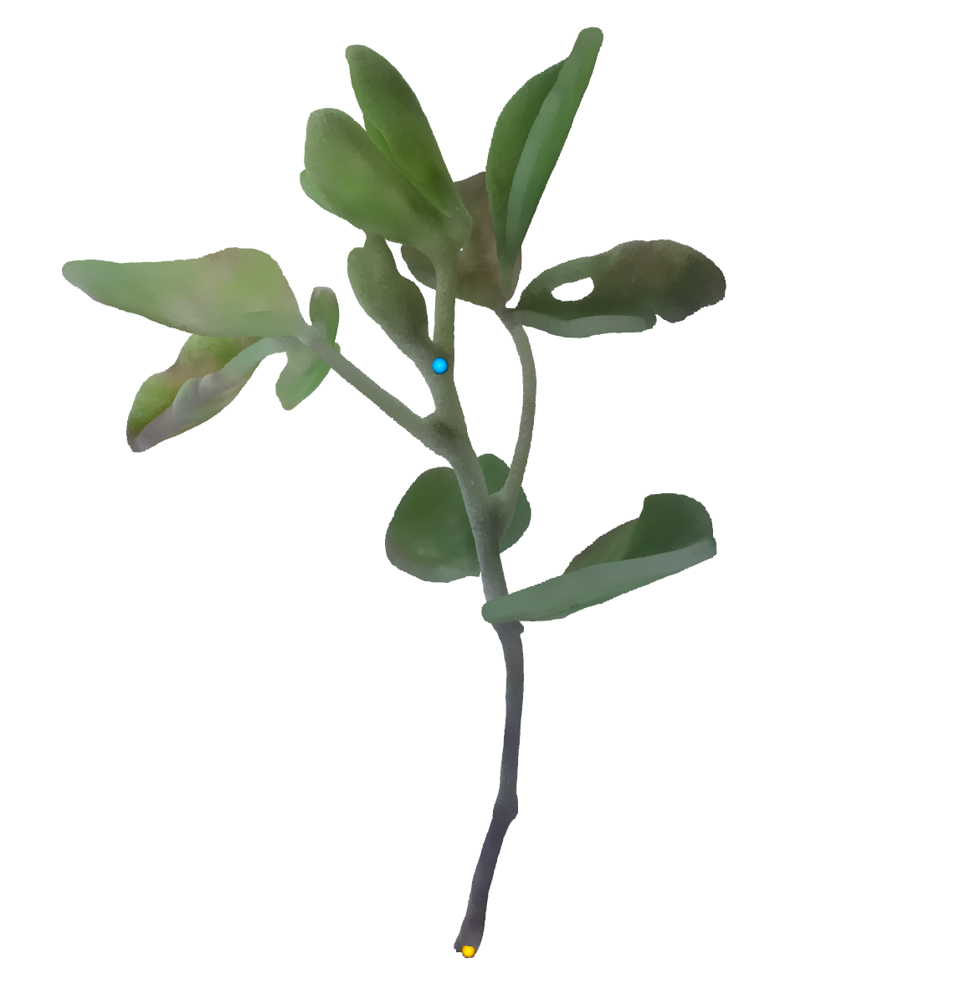
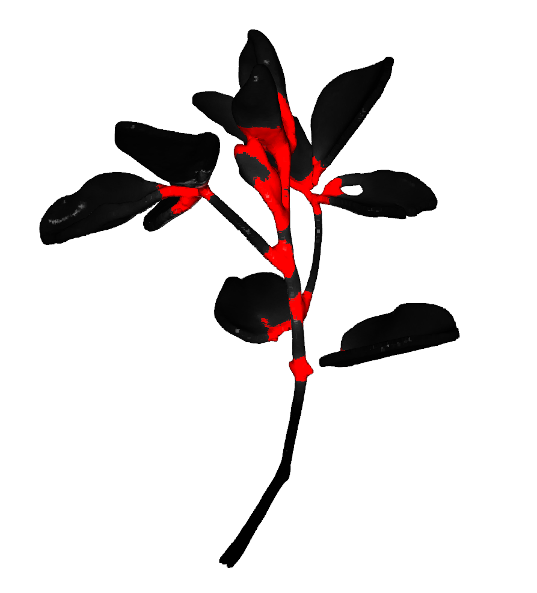
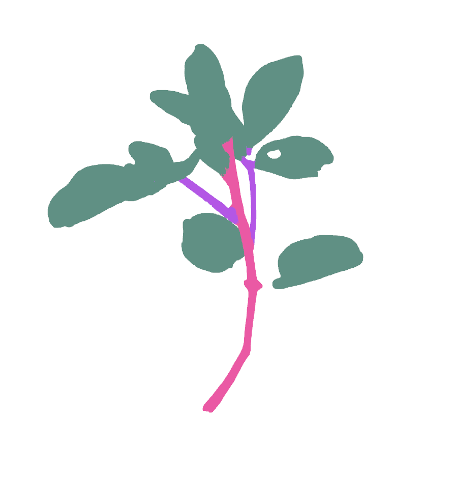
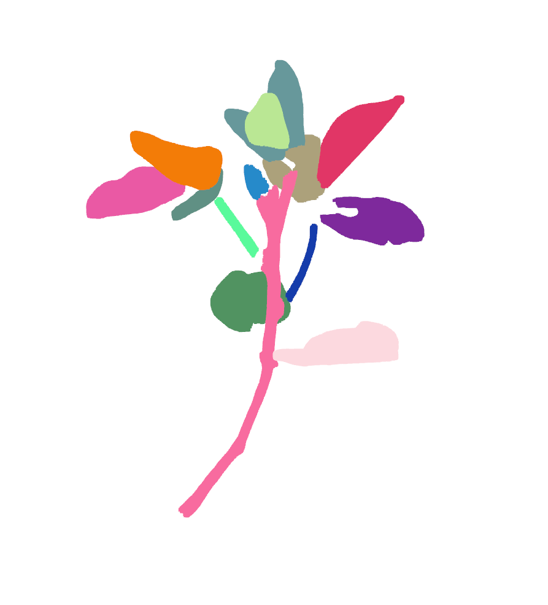
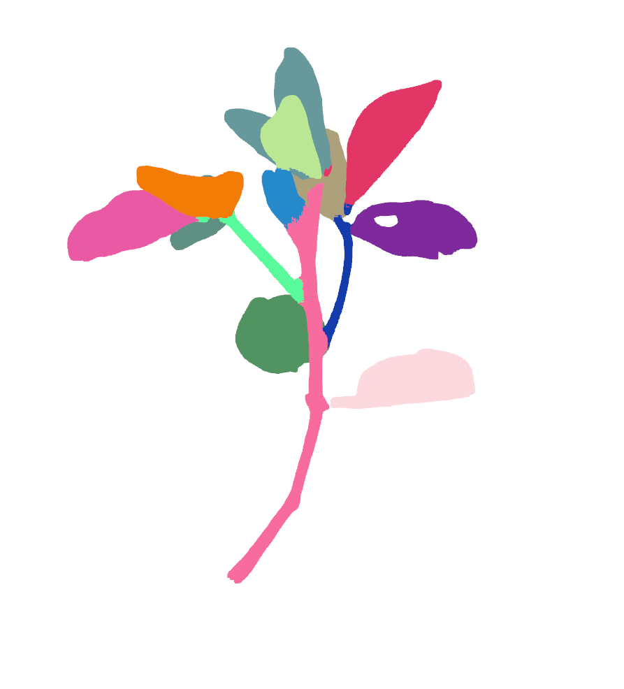
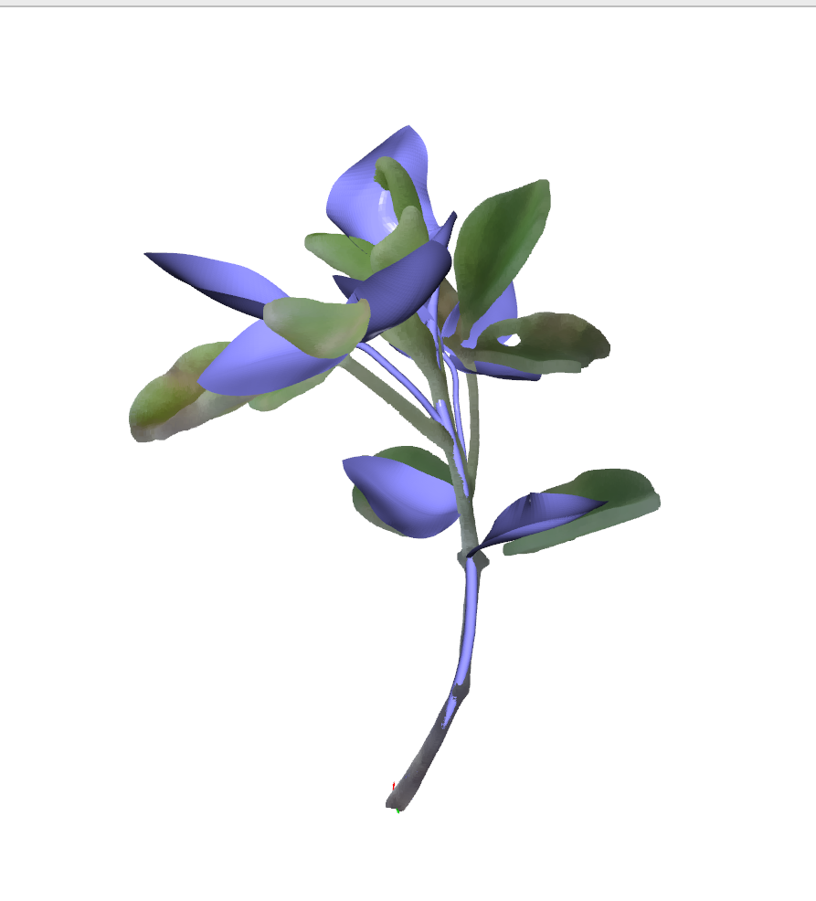

# reconstruction demeter representation from raw 3d point cloud

note: this is a optimization based method, which highly rely on the quality of the input point cloud and cannot handle missing part of the raw data.

## Environment

All steps below run in the single `demeter` conda environment created in the [main readme](../readme.md#2-requirements)
(there is no separate `pointcept` environment). Step 2 (Point Transformer) needs a few extra dependencies
on top of the base environment; install them into the same env:

```bash
conda activate demeter

# extra dependencies for Step 2 (Point Transformer / Pointcept)
pip install torch_scatter torch_cluster torch_geometric==2.5.3 addict SharedArray yapf==0.30.0

# build the point-ops CUDA extension bundled with Pointcept
pip install third_party/PointTransformer_V3/Pointcept/libs/pointops
```

Note: `torch_geometric` is pinned to `2.5.3` (2.6+ requires `pyg-lib` for `voxel_grid`), and `spconv` is
**not** required for the model used here.

## Step 1: align stem to X axis and normalized point cloud

This script will normalize the data into mean offset and unit scale (95% points will within [−1,1]³), also align the main stem to X axis ([1, 0, 0]). And it requires manually click two points on the main stem to find the direction. First click should be  on the main stem bottom (yellow dot), second should be on another point near the top (blue dot), but no need to be exact. 

```bash
python script_auto_reconstruction/normalize_data.py --point_path sample_point_cloud/val/27_o/pcd.ply
```



this requires the user to annotate 2 keypoints on the main stem (one bottom, one top) like the above image. 


## Step 2: infer semantics (stem/leaf) and segmentation from point transformer

Predict semantics and SDF between clusters using Point-Transformer (in the `demeter` conda environment, see the Environment section above).
This process may take ~1 minute

1. download the pretrained weight (`exp.zip`) from [Hugging Face](https://huggingface.co/TianhangCheng7/DemeterPointSeg/tree/main) and extract it to `third_party/PointTransformer_V3/Pointcept/exp`

```bash
# from the repo root; downloads exp.zip and extracts to third_party/PointTransformer_V3/Pointcept/exp
wget -O exp.zip https://huggingface.co/TianhangCheng7/DemeterPointSeg/resolve/main/exp.zip
unzip -o exp.zip -d third_party/PointTransformer_V3/Pointcept/
rm exp.zip

# (alternative) using the huggingface_hub CLI
# hf download TianhangCheng7/DemeterPointSeg exp.zip --local-dir . && \
#   unzip -o exp.zip -d third_party/PointTransformer_V3/Pointcept/ && rm exp.zip
```

After extraction you should have `third_party/PointTransformer_V3/Pointcept/exp/soybean3d/plant3/model/model_last.pth`.

2. run command

```bash

conda activate demeter

cd third_party/PointTransformer_V3/Pointcept

sh scripts/test.sh -p python -d soybean3d -c custom3 -n plant3 -g 1 -w model_last

# copy the result from PointTransformer to the data folder (paths are relative to the Pointcept dir cd'd into above)
cp exp/soybean3d/plant3/result/normalized_pcd_pred_dist.npy ../../../sample_point_cloud/val/65_i
cp exp/soybean3d/plant3/result/normalized_pcd_pred.npy ../../../sample_point_cloud/val/65_i

```

## Step 3: build plant graph from prediction

Fit each node instance separately and combine them as a graph. The fitting may take ~1 minute for each node.

use the demeter conda environment.

```bash
conda activate demeter

python script_auto_reconstruction/recon.py --data_folder sample_point_cloud/val/65_i --species soybean
```

This writes the fitted parametric plant to the data folder, mainly `graph.pkl` (the plant graph:
topology + per-node stem/leaf PCA parameters) together with `params/info/{parent,class}.txt`
(topology and stem/leaf semantics). `predict.ply` is the reconstructed surface overlaid on the input,
for quick inspection.

## Step 4: decode the graph to a 3D mesh

Regenerate the plant mesh from the fitted graph with the top-level `decode.py`, which reads
`<data_folder>/<species>/instances/<sample_name>/graph.pkl` (plus `info/{parent,class}.txt`), so first
place Step 3's output there:

```bash
mkdir -p sample_params/soybean/instances/65_i/info
cp sample_point_cloud/val/65_i/graph.pkl         sample_params/soybean/instances/65_i/graph.pkl
cp sample_point_cloud/val/65_i/params/info/*.txt sample_params/soybean/instances/65_i/info/

python decode.py --data_folder sample_params --sample_name 65_i --species soybean
```

### Visualization (if do_viz=True)

1. Point transformer predicts inter-cluster distances for each points, we detect boundary points (red area) by a threshold.



2. Point transformer predicts semantics. Pink is main stem, purple is other stems, green is leaf.



3. Use DBSCAN to get initial cluster



4. Add boundary points to nearest cluster



5. Final Reconstruction overlapped with input point cloud



