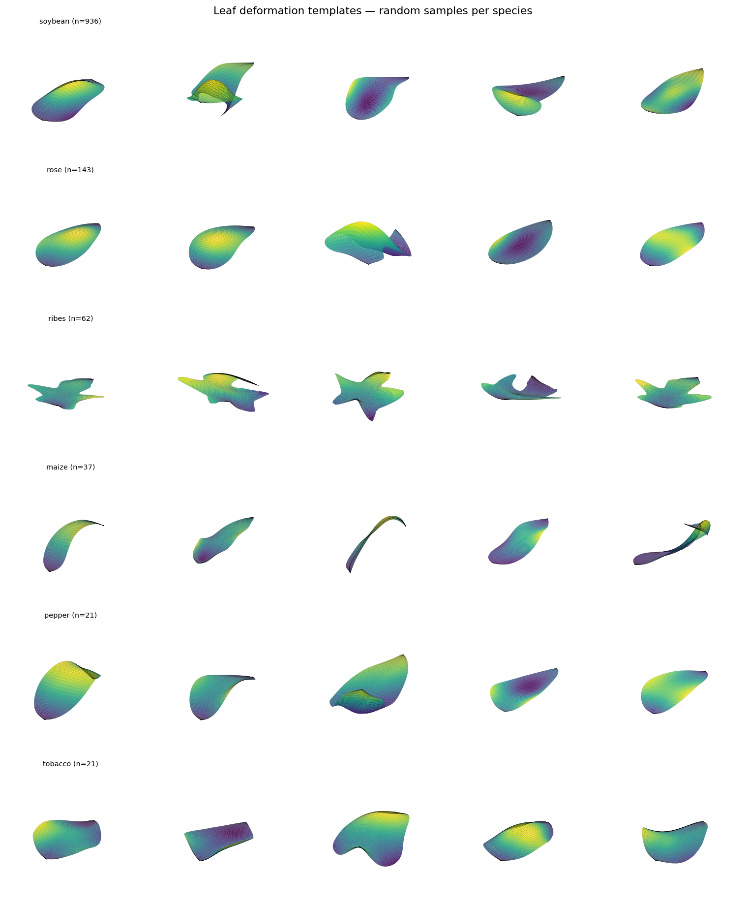
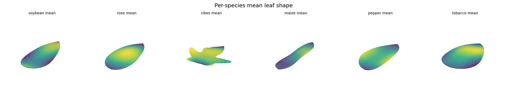
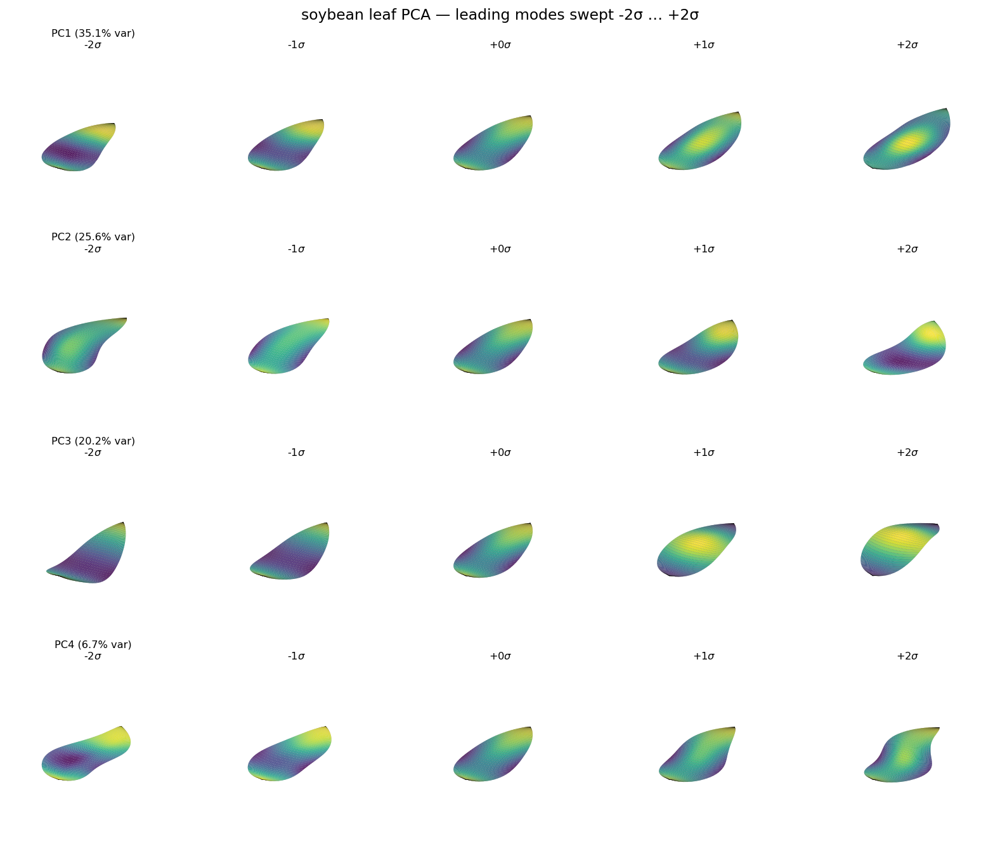

# 3D leaf PCA (fitting & visualization)

This folder contains everything needed to (re)fit and inspect the **3D leaf
shape PCA** used by Demeter's decoder — the `sample_params/<species>/3d_leaf_pca.pth`
bases read by `decode.py`.

## 3D leaf deformation data (for PCA training)

Each species ships a NumPy array of fitted 3D leaf surfaces with shape
`[n_leaf, 43, 45, 3]` — `n_leaf` leaves, each sampled on a fixed `43 x 45` grid
of 3D points. Every leaf is stored in a canonical frame (blade base at the
origin, main axis along `+y`), so the array captures the pure 3D bending/curl of
the leaf blade in dense correspondence. These are exactly the samples used to fit
`sample_params/<species>/3d_leaf_pca.pth`.

| species | n_leaf |
|---------|-------:|
| soybean | 936 |
| rose    | 143 |
| ribes   | 62  |
| maize   | 37  |
| pepper  | 21  |
| tobacco | 21  |

The arrays are hosted on the
[DemeterData](https://huggingface.co/datasets/TianhangCheng7/DemeterData)
dataset. Download them into place (run from the repo root):

```bash
hf download TianhangCheng7/DemeterData --repo-type dataset \
    --include "leaf_deformed_mesh/*.npy" --local-dir .
# -> leaf_deformed_mesh/<species>.npy
```

## Fit the PCA

`fit_leaf_3d_pca.py` loads `leaf_deformed_mesh/{species}.npy`, fits the repo's
`NodePCA` (keeping 99.5% of variance), and writes
`sample_params/{species}/3d_leaf_pca.pth` — reproducing the shipped bases.

```bash
# fit every species found in leaf_deformed_mesh/
python script_fit_leaf_3d_pca/fit_leaf_3d_pca.py --species all

# or a single species
python script_fit_leaf_3d_pca/fit_leaf_3d_pca.py --species soybean
```

Minimal equivalent in Python:

```python
import numpy as np
from utils.pca import NodePCA

species = "soybean"
data = np.load(f"leaf_deformed_mesh/{species}.npy")   # (n_leaf, 43, 45, 3)
n = data.shape[0]

pca = NodePCA(n_components=0.995)          # keep enough modes for 99.5% variance
pca.train(data.reshape(n, -1))            # (n, 43*45*3)
pca.save(f"sample_params/{species}/3d_leaf_pca.pth")

# sample a leaf from the learned basis: +2 sigma along the first component
coeff = np.zeros(pca.components.shape[0], dtype=np.float32)
coeff[0] = 2.0 * pca.coeff_std[0].item()
leaf = pca.decode(coeff).reshape(43, 45, 3)
```

## Visualize

### Dataset gallery & per-species means — `viz_leaf_deform.py`

```bash
python script_fit_leaf_3d_pca/viz_leaf_deform.py
# -> script_fit_leaf_3d_pca/assets/leaf_deform_gallery.png
# -> script_fit_leaf_3d_pca/assets/leaf_deform_means.png
```

Random sample leaves, one row per species:



Per-species mean leaf shape:



### PCA modes swept ±2σ — `viz_pca_modes.py`

Fits the PCA for one species and sweeps each leading component from −2σ to +2σ
(other components held at zero):

```bash
python script_fit_leaf_3d_pca/viz_pca_modes.py --species soybean --n-modes 4
# -> script_fit_leaf_3d_pca/assets/soybean_leaf_pca_modes.png
```



## Notes

- All scripts default `--data-dir` to `<repo_root>/leaf_deformed_mesh` and can be
  run from any working directory; pass `--data-dir` to point elsewhere.
- `NodePCA` (`utils/pca.py`) runs on CPU or CUDA via `utils/device.py`, so
  fitting works without a GPU.
