# reconstruction demeter representation from raw 3d point cloud

note: this is a manual annotation method to create "ground-truth" Demeter prameters. It's accurate but time consuming.

## Step 0: align stem to X axis and normalized point cloud

This script will only align main stem to X axis ([1, 0, 0]) but **no scaling**. And it requires manually click two points on the main stem to find the direction. First click should be **exactly** on the main stem bottom (yellow dot), second should be on another point near the top (blue dot), but no need to be exact.

```bash
python script_manual_annotation/align_data.py --point_path sample_point_cloud/val/7/pcd.ply
```

Since the point cloud from SfM or 2DGS usually has different scale from the real-world, we recommend to scale the input pcd to the real-world metric (like meters) by yourself before running this. 

## Step 1: using Cloud Compare or other 3D software to do segmentation

Download cloudcompare from the [link](https://cloudcompare-org.danielgm.net/release/)

(1) Drag `pcd.ply` to windows

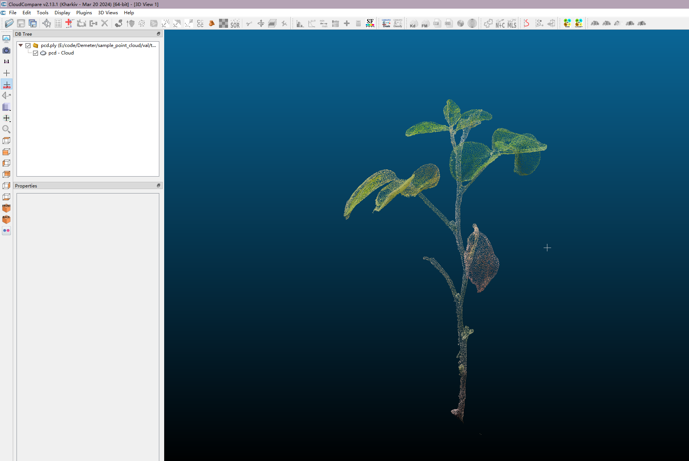

(2) Click segementation tool

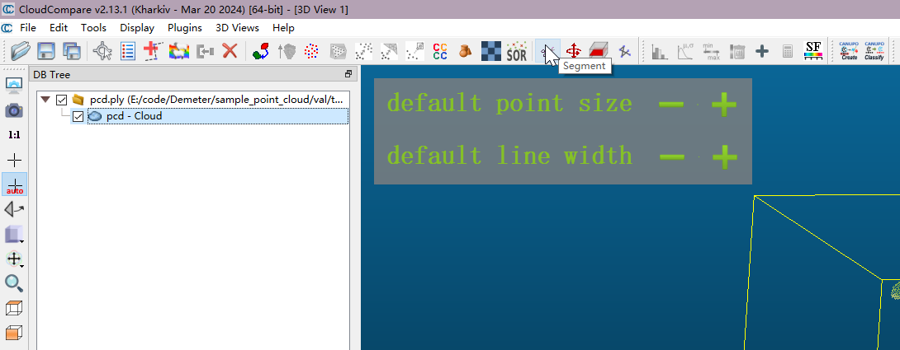

(3) Segment Each part by drawing polygon, click the red "segment in" or "segment out", then click green "confirm" to seperate the part from other points.

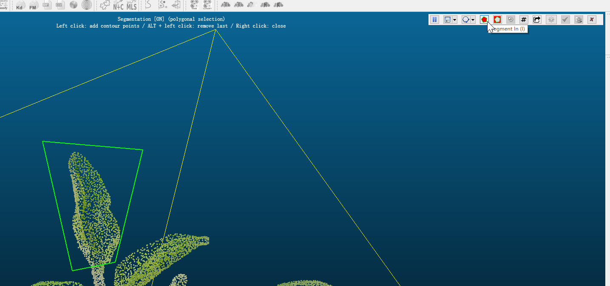

(4) Repeat above process to get many small pcd in the sidebar. You can delete some noisy pcd, but please be very careful because deleting operation is not revertiable in cloudcompare.

(5) The final result looks like this

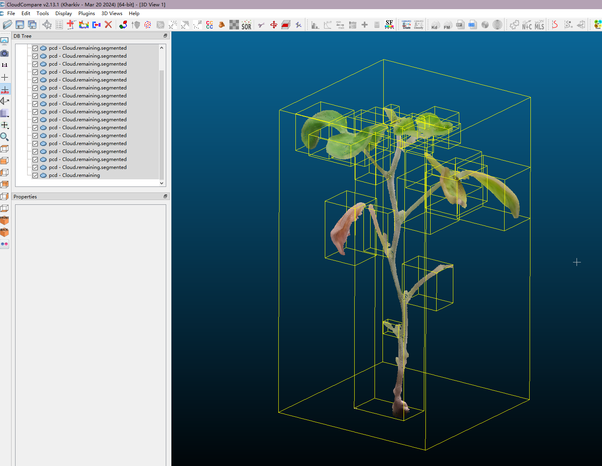

(6) It's recommanded to rename them in this stage so you can track which one is saved, which one is not. But you can rename them later too.

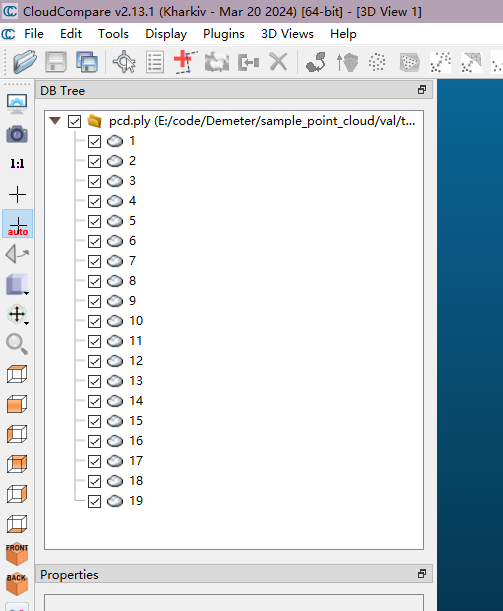

(7) Save those files to folder, e.g. `sample_point_cloud\val\7\raw`, either BINARY or ASCII format is fine.

## Step 2: Using script to annotate segmentation and topology

1. 脚本做什么

- 规范化 `raw/*.ply` 文件名（补零到三位）
- 标注主干（root，`parent=-1`）
- 标注类别（leaf/stem/flower/fruit）
- 逐个标注 parent 关系（可接受自动猜测，也可手动纠正）
- 可选进行 post-merge（合并点云并同步 parent/class）
- 最后标注 leaf root 点

2. 目录结构要求

假设你的样本名是 `7`，脚本会使用：

- `<data_root>/7/raw/*.ply`
- `<data_root>/7/info/parent.txt`
- `<data_root>/7/info/class.txt`

如果文件不存在，脚本会自动创建 `info`、`temp` 等目录。

3. 推荐运行方式

在项目根目录运行：

```bash
python script_manual_annotation/annotate_parent.py --data-root sample_point_cloud/val --meta-name 7a
```

常用参数：

- `--meta-name`: 样本名
- `--data-root`: 数据根目录（不传时按系统默认路径）
- `--screen-width`: 可视化窗口宽（默认 `900`）
- `--screen-height`: 可视化窗口高（默认 `900`）
- `--skip-post-merge`: 跳过 post-merge 阶段

4. Detailed Process

(1) Run above command and it will show current segmentations, and do auto-renaming

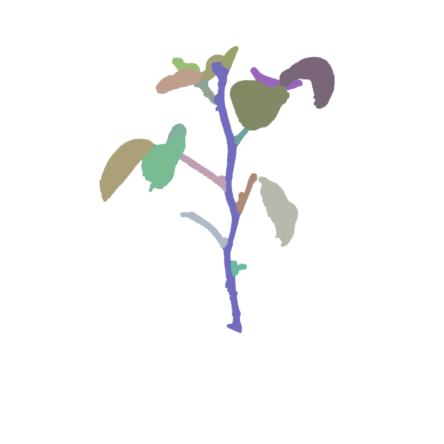

(2) Now consol will show `merge point clouds`. If you want to merge two segmentations, click two points on two different parts, then close the window. It will merge the two parts then. If no need, just close the window, this option will not appear in the future.

(3) First, it will say `annotate main stem`. Click one point on the main stem, then close the window.

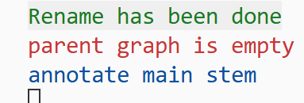

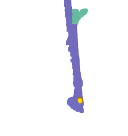

(4) Then, it will say `annotate flowers`. Click one point on 1 flower at one time, close the window. Don't click multiple points. Repeat this if needed. If no flower, close the window.

(5) Then, it will say `annotate fruits`. Click one point on 1 fruit at one time, close the window. Don't click multiple points. Repeat this if needed. If no fruit, close the window.

(5) Then, it will say `annotate isolated stem`. `Isolated stem` means the stem without leaf connected it as parents. Since the later process will think all nodes without childrens are stem, so it's required to annotate isolated stem in this stage. But if stem has child stem or leaf, you can skip them. Click one point on 1 stem at one time, close the window. Don't click multiple points. Repeat this if needed. If no isolated stem, close the window. The isolated stem will be shown in `blue`.

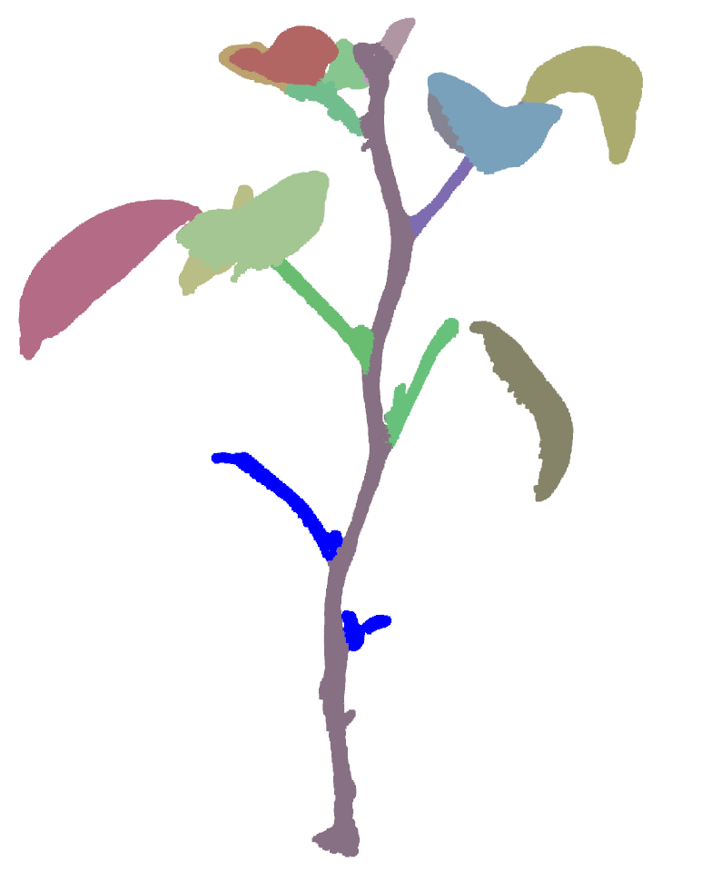

(6) Next, it will loop all parts and guess its parent. Current part is shown in `black`, and the guessed parent is shown in `green`. If you find the guess result correct, just close the window. Otherwise click one point in the correct part and close. If you do correction, the window will re-show the result you choose for you to confirm.

the guess result is wrong

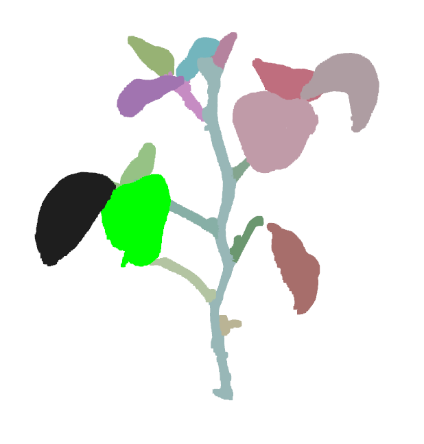

click one point on correct part

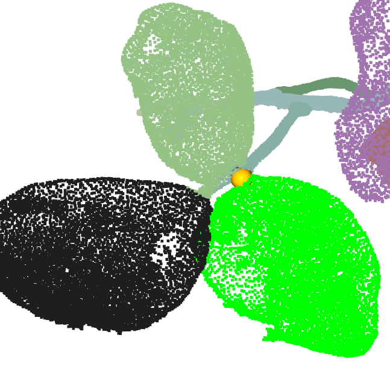

now it's correct

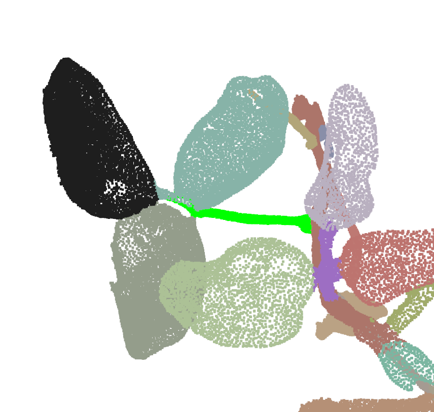

- 在 Open3D 窗口中，`Shift + 左键` 选点，`Q` 结束选择。
- 在 parent 标注阶段：
  - 选 `0` 个点：接受脚本自动猜测的 parent
  - 选 `1` 个点：按你点到的对象重新选 parent
  - 选 `>=2` 个点：生成连接段（补断裂）

(7) `merge point clouds and graph`. Since you may connect broken part, you can click two points on two parts to merge them into one in this stage. If no need, just close window and skip.

(8) If the topology is valid, it will print `Parent graph connectivity check passed (single component, no loop).`

常见问题

Q1: 提示 loop detected

说明 `parent.txt` 里出现了环，先修复再继续。

Q2: 提示有多个 disconnected components

说明有些子树没连到主树，通常需要回到 parent 标注阶段补连。

Q3: 标注窗口太小或太卡

- 调大窗口：`--screen-width 1400 --screen-height 1000`
- 先用 `--skip-post-merge` 跳过重操作，先把 parent/class 标完

(9) Do leaf root annotation. It will guess the leaf root, shown in `blue` ball. If you find it wrong, just click the correct place and close the window.

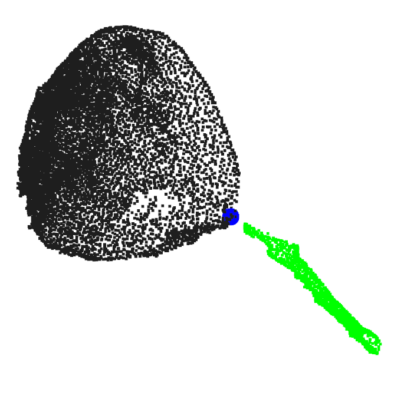

## Step 3: run optimization to get Demeter Prameters

`fit.py` will fit the leaf and stem with the segmentation point cloud seperately.

`finetune.py` will adjust the global error by fitting the whole point cloud.

```bash
conda activate demeter

python script_manual_annotation/fit.py --mesh_dir sample_point_cloud/val/7a --species soybean
python script_manual_annotation/finetune.py --mesh_dir sample_point_cloud/val/7a --species soybean
```

Finally, it will visualize the pcd with the demeter parametric mesh.

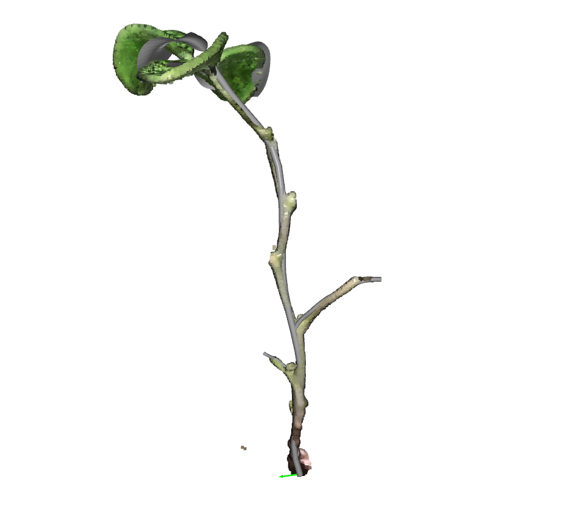