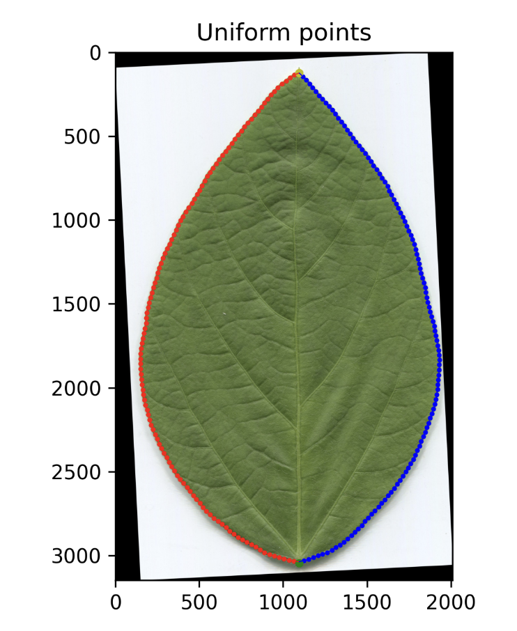

## Full 2D leaf dataset
We build the 2d leaf shape PCA on [FGLIR dataset](https://github.com/NUFE-AIAG/FGLIR) for soybean and on [Folio leaf dataset](https://archive.ics.uci.edu/dataset/338/folio) dataset for other species.

## Run pipeline

Note that step 2 requires your computer has a screen.

```txt
step 1: segmentation using sam2
step 2: click keypoint
step 3: rotate according
step 4~6: find contour and fit 2d PCA
```

```
# return to /script_process_leaf_contour
cd .. 

# Run whole pipeline use sample data (or your custom folder) — uses CPU (rembg) by default
python process.py --data-dir ../sample_leaf_data/soybean

# Use GPU (SAM2) for more accurate segmentation in step 1
python process.py --data-dir ../sample_leaf_data/soybean --gpu

# Or run a single step one by one
python 1_get_leaf_mask_cpu.py --data-dir ../sample_leaf_data/soybean
python 2_click_keypoints.py --data-dir ../sample_leaf_data/soybean
python 3_rotate_img_and_mask.py --data-dir ../sample_leaf_data/soybean
python 4_find_contour.py --data-dir ../sample_leaf_data/soybean
python 5_solve_pde.py --data-dir ../sample_leaf_data/soybean
python 6_pca_inner.py --data-dir ../sample_leaf_data/soybean
```

For step 1, the pipeline uses `rembg` (CPU) by default. If you have a GPU, use `--gpu` to run `sam2` instead — it produces more accurate segmentation masks for complex image. Here is the tutorial:
```bash
# Install SAM2 for auto segmentation
# The sam2 code is already in the repo. If get any bugs or issue, please follow the official [installation guidance](https://github.com/facebookresearch/sam2#installation).
# install
cd script_process_leaf_contour/sam2
pip install -e .

# download sam2 ckpt
cd checkpoints && \
./download_ckpts.sh && \
cd ..
```

for step 2, click 2 point on the leaf bottom and top respectively. press 'ESC' to continue to next image.


after running step 4, there will be viz for the leaf edge



step 5 may take for a while to solve the equation

## QA
1. `ModuleNotFoundError: No module named 'utils'`

remember to `pip install -e .` in root dir

2. `ModuleNotFoundError: No module named 'rembg'`

run `pip install rembg` 