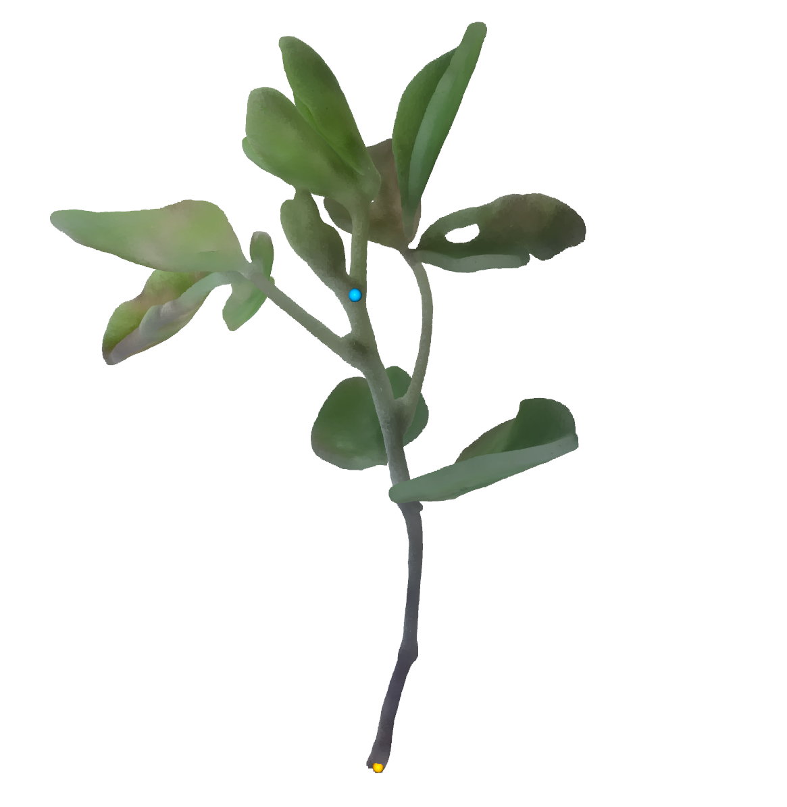
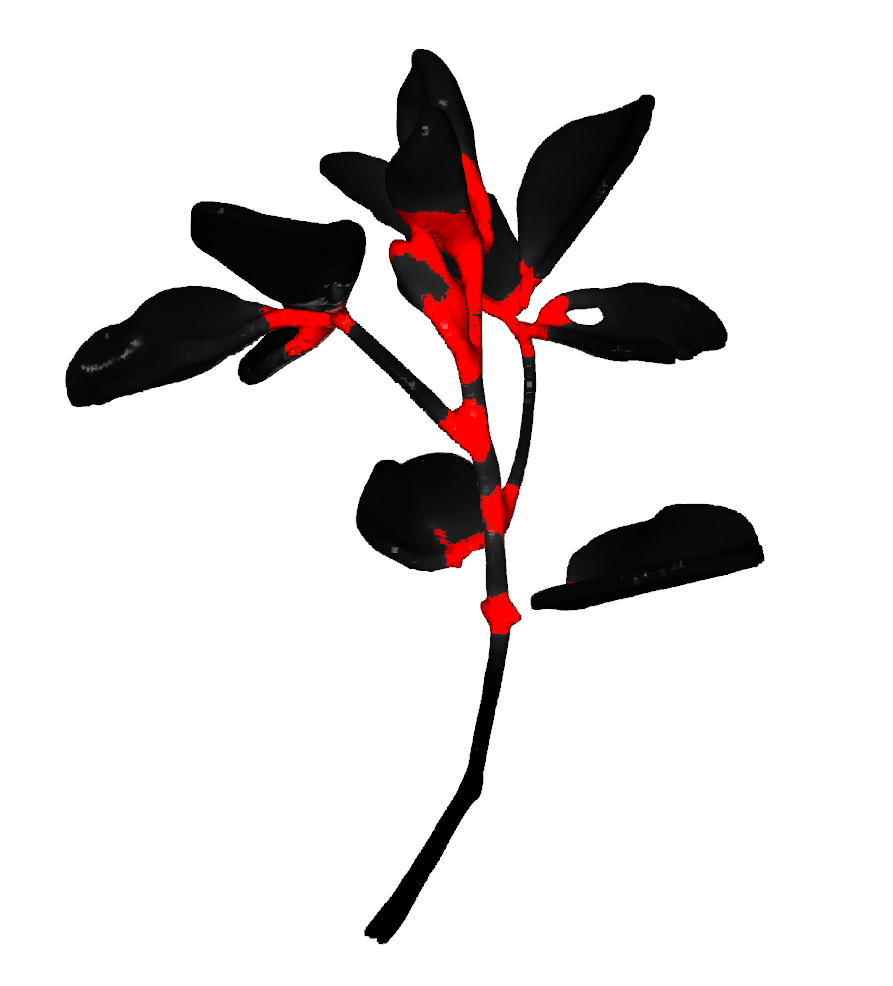
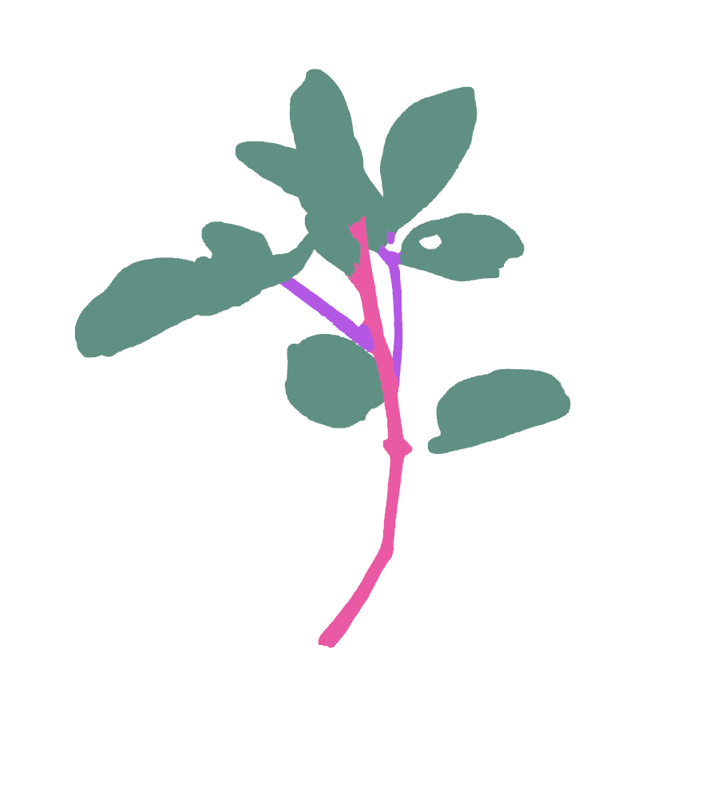
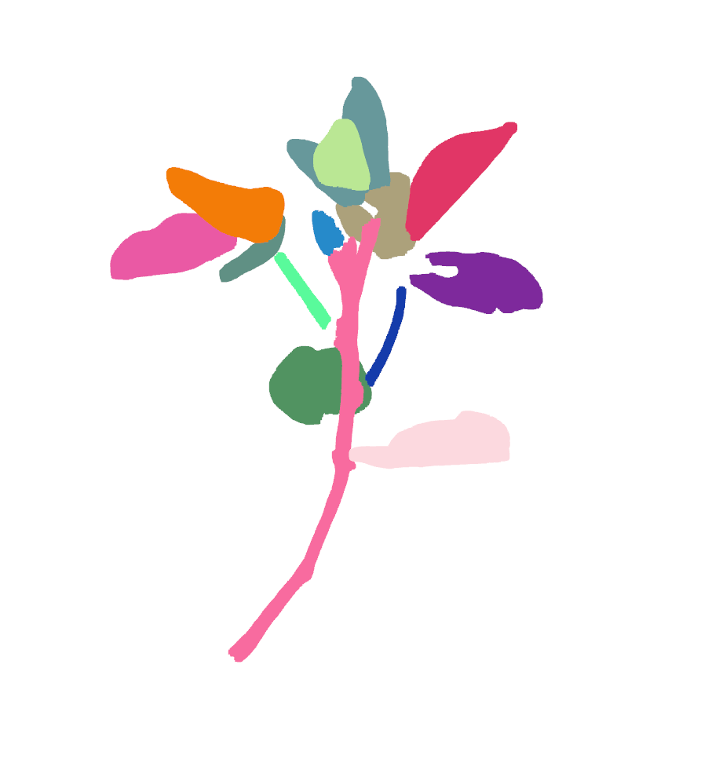
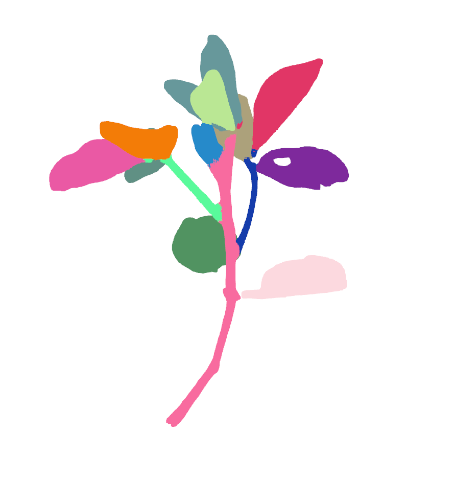
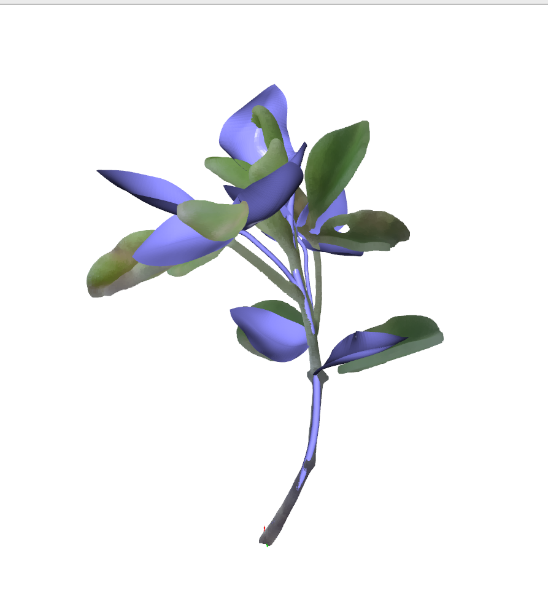

# reconstruction demeter representation from raw 3d point cloud

note: this is a optimization based method, which highly rely on the quality of the input point cloud and cannot handle missing part of the raw data.


## Step 1: normalized point cloud

This script will normalize the data into mean offset and unit scale. And it requires manually click two points on the main stem to find the direction. First click should be on the bottom (yellow dot), second should be on the top (blue dot).

```bash
cd script_reconstruction/process_data.py
```


this requires the user to annoate 2 keypoints on the main stem (one bottom, one top) like the above image. 


## Step 2: infer semantics (stem/leaf) and segmentation from point transformer

Predict semantics and SDF between clusters using Point-Transformer (under Point transformer conda envrionment).
This process may take ~1 minutes

```bash

conda activate pointcept

cd third_party/PointTransformer_V3/Pointcept

sh scripts/test.sh -p python -d soybean3d -c custom3 -n plant3 -g 1 -w model_last

# copy the result from PointTransformer to data folder
cp third_party/PointTransformer_V3/Pointcept/exp/soybean3d/plant3/result/normalized_pcd_pred_dist.npy sample_point_cloud/val/65_i
cp third_party/PointTransformer_V3/Pointcept/exp/soybean3d/plant3/result/normalized_pcd_pred.npy sample_point_cloud/val/65_i

```

## Step 3: build plant graph from prediction

Fit each node instance seperately and combine them as a graph. The fitting may takes 1 minutes for each node.

use the demeter conda environment.

```bash
conda activate demeter

python recon.py
```

### Visualization (if do_viz=True)

1. Point transformer predicts inter-cluster distances for each points, we detect boundary points (red area) by a threshold.



2. Point transformer predicts semantices. Pink is main stem, purple is other stems, green is leaf.



3. Use DBSCAN to get initial cluster



4. Add bounday points to nearest cluster



5. Final Reconstruction overlapped with input point cloud



