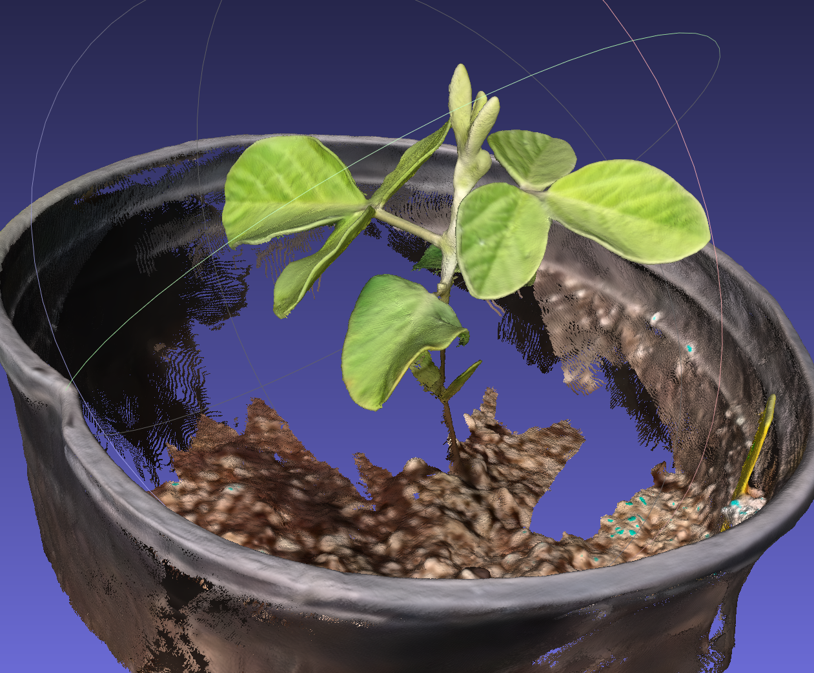

# reconstruction 2dgs and extract mesh from video

## Dependency Requirements

The pipeline was tested on Windows 10.

(1) COLMAP

For COLMAP, please follow [this link](https://github.com/colmap/colmap?tab=readme-ov-file) to get the excutable file.

(2) 2DGS

please follow [this link](https://github.com/hbb1/2d-gaussian-splatting)

## Run SfM

```bash

cd third_party/2d-gaussian-splatting

# extract frames (the output folder should have name 'input')
# scale_ratio means the image is scaled
python extract_frames.py --video_path ../../sample_video/001.mp4 --output_dir ../../sample_video/001/input --target_fps 10 --scale_ratio 0.5

# Run sfm to get camera poses (change to your COLMAP.bat path (tesed on Windows))
# may takes minutes depending on the resolution and video length
python convert.py -s ../../sample_video/001 --colmap_executable "D:/COLMAP/COLMAP.bat"
```

## Train 2DGS

```bash

# Train 2dgs (change to your path)
python train.py -s ../../sample_video/001 --iteration 15000

# Extract Mesh from weight
python render.py -s ../../sample_video/001 -m ../../sample_video/001 --skip_test --skip_train --mesh_res 1024 --depth_trunc 5 

```

the output mesh will be found in ```sample_video\001\train\ours_5000\fuse_decimated.ply```

<p align="center">
  
  The reconstruction result of 2DGS.
</p>

<p align="center">
  
  The folder structure.
</p>
