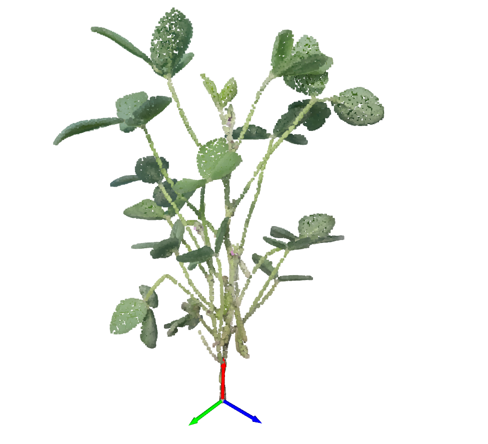
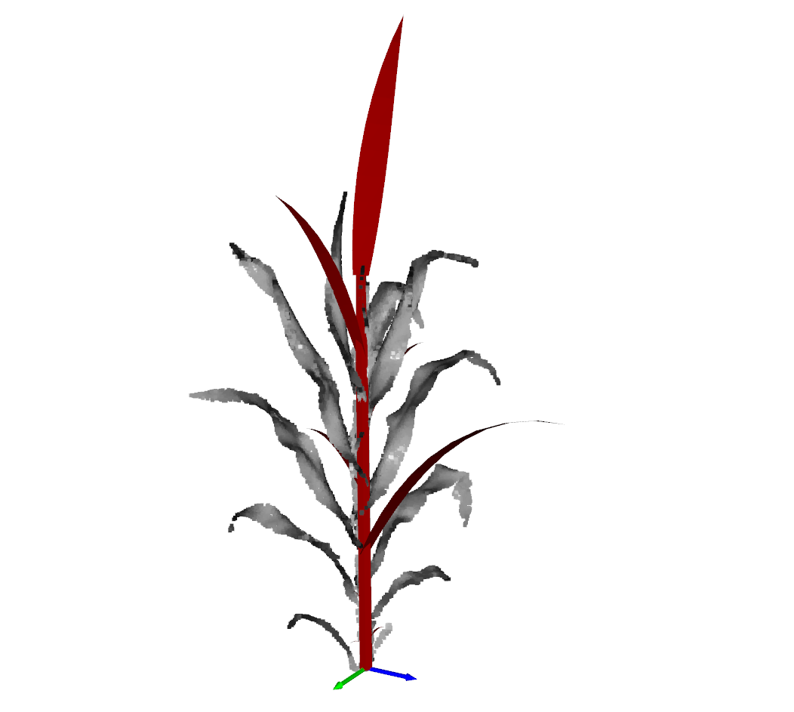

## Reconstruction from point cloud using L-system

Note: this baseline only supports ```soybean``` and ```maize```



The input sample point cloud. 
 
```bash

# process raw point cloud to align the main stem of input point cloud to X-axis, and the bottom tip to origin.
python script_auto_reconstruction/process_data.py --point_path sample_point_cloud/val/27_o/pcd.ply

# change point cloud path in fit_single based on your need
# you will get original_aligned.ply from above step
python third_party/CropCraft/fit_single.py --point_path sample_point_cloud/val/27_o/original_aligned.ply --species soybean
```

```bash
# another example for maize
python script_reconstruction/process_data.py --point_path sample_point_cloud/val/10008da/pcd.ply
python third_party/CropCraft/fit_single.py --point_path sample_point_cloud/val/10008da/original_aligned.ply --species maize
```




Reconstrution result (red mesh) and the input point cloud.

## Acknowledgement

We thank Albert Zhai to provide the implementation for [CropCraft](https://arxiv.org/abs/2411.09693).